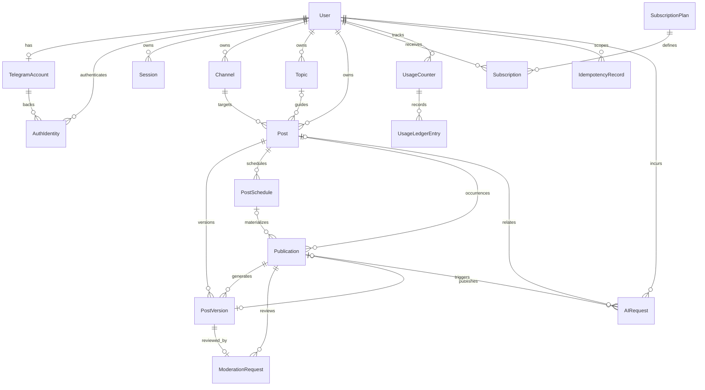

# Domain model

## Aggregate boundaries

- `User` owns identity, channels, topics, posts, sessions, subscription, and usage.
- `Post` is a reusable content definition. It is not a publication attempt.
- `PostVersion` is immutable generated/revised content.
- `PostSchedule` describes when publication occurrences should be materialized.
- `Publication` is one durable immediate or scheduled occurrence and owns its execution state.
- `ModerationRequest` records a decision for one version in one publication occurrence.
- `AIRequest`, `OutboxEvent`, and `AuditEvent` are durable supporting records.
- GPT conversation transcripts and image content are not persistence entities.

## ER diagram

## Identity responsibilities

| Entity            | Responsibility                                         | Key uniqueness                                        |
| ----------------- | ------------------------------------------------------ | ----------------------------------------------------- |
| `User`            | Internal identity, status, locale, timezone            | UUID primary key                                      |
| `TelegramAccount` | Canonical numeric Telegram account and mutable profile | `telegramUserId` globally unique; one per user in MVP |
| `AuthIdentity`    | External login subject                                 | `(provider, subject)` unique                          |
| `Session`         | Revocable browser session                              | `secretHash` unique                                   |

## Ownership

- MVP is single-user, not organization/team based.
- Every user-scoped query includes ownership in the database predicate; fetching by ID and checking afterward is discouraged.
- A Telegram channel is linked to one Autobot user in MVP. Reassignment is an explicit audited operation, not a second create.
- Topics belong to a user and may be used with any channel owned by that same user.
- Post references must point to channel/topic records owned by the post owner.

## Persistence rules

- Application IDs are UUIDs. Telegram IDs use PostgreSQL `BIGINT` and JSON decimal strings.
- All mutable aggregates have `createdAt`, `updatedAt`, and integer `version` where concurrent commands matter.
- Historical versions, moderation decisions, publications, usage ledger entries, and audit events are append-only except for narrowly defined status transitions.
- User-facing deletes archive/soft-delete referenced records. Hard deletion is a retention operation.
- `PostVersion.text` is immutable after generation; revisions create a new sequence.
- `PostVersion.text` is the final product artifact, not a provider conversation transcript.
- Raw provider messages/responses and generated image bytes, URLs, or filesystem paths are never stored in PostgreSQL.
- `AIRequest` contains accounting/operational metadata only and no content payload.
- Each schedule occurrence is unique by `(scheduleId, scheduledFor)`.
- Each idempotent command is unique by principal, operation, and idempotency key in the idempotency store introduced during implementation.
- Outbox rows are written in the domain transaction and may be retried until delivered.

## Subscription and usage

- Plan entitlements are structured JSON validated by application schema and exposed as typed read models.
- The default plan applies when no active paid/trial subscription exists.
- MVP quota periods are calendar months in UTC; this policy is data/configuration-driven for later evolution.
- Count entitlements such as channels/topics are calculated from active owned records under transaction/locking.
- Costly asynchronous operations use `reserve -> commit` on success or `reserve -> release` on terminal failure.
- Usage ledger operation keys make all three operations idempotent.

## Audit policy

Persist `AuditEvent` for security- and lifecycle-sensitive actions:

- login/logout/session revocation and identity-link conflict;
- channel link/revalidation/removal;
- subscription/entitlement administrative changes;
- moderation approve/reject/revision;
- schedule create/update/pause/resume/cancel;
- manual publication retry/cancel.

Routine reads and internal polling are not audited. Audit metadata is allowlisted and must not contain secrets, prompts, generated content, provider responses, image references, or provider credentials.

## Prisma proposal

[`prisma-model-proposal.prisma`](./prisma-model-proposal.prisma) is the Stage 2 starting point, not a generated/runtime schema. Stage 2 may make syntax/index adjustments, but changes to ownership, uniqueness, or aggregate meaning require an architecture update.
